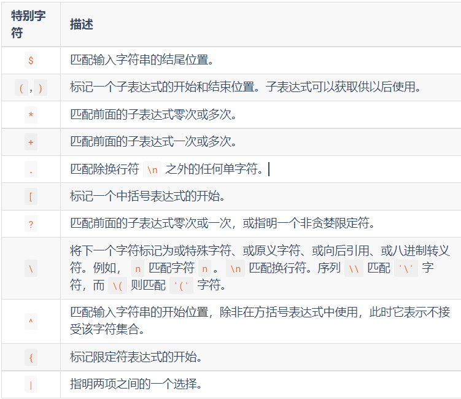
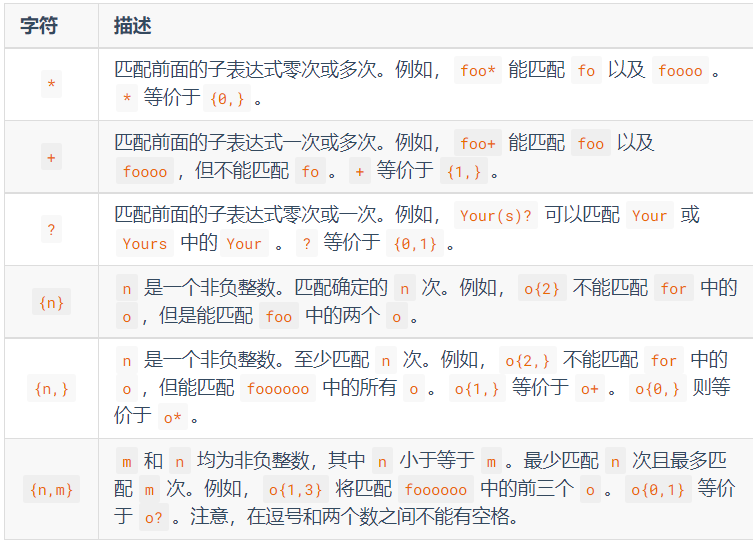
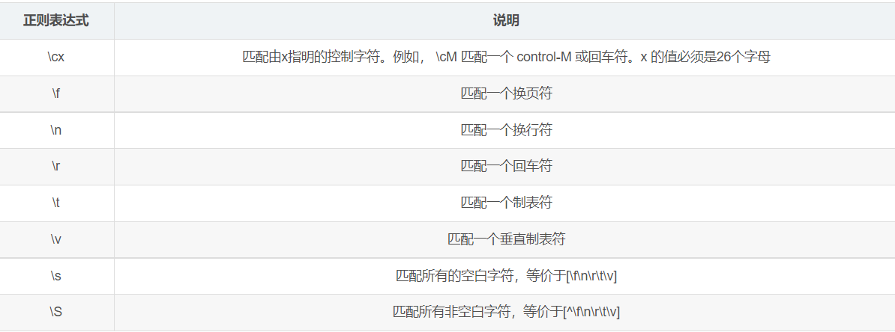
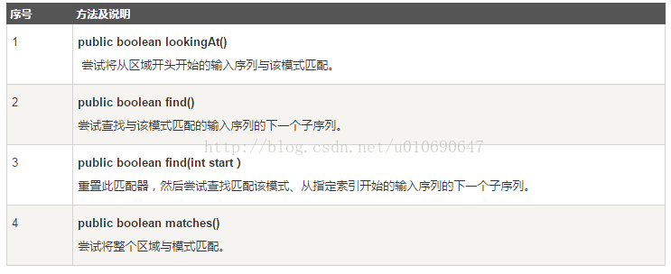

# coursework1学习记录

## 前言
本文用于记录自己在完成学习

## Character类介绍
为了检测目标字符串是否含大小写字母、数字、其它字符，了解到的。
### 主要方法
- public static boolean isUpperCase(char ch):判断给定的字符是否是大写字符(字母)
- public static boolean isLowerCase(char ch):判断给定的字符是否是小写字符
- public static boolean isDigit(char ch):判断给定的字符是否是数字字符
- public static char toUpperCase(char ch):把给定的字符转换为大写字符
- public static char toLowerCase(char ch):把给定的字符转换为小写字符

## 正则表达式介绍
之前学习算法时，有题目就是正则表达式的一个dp题，自己看了会正则表达式，心早已飞向诗与远方。如今想来，这也是某种~~孽缘~~缘分吧。
本篇会主要介绍在java里使用正则表达式，当然核心是正则表达式的学习，语言只是工具，能力才是本源。

### java.util.regex介绍
在java自带的java.util.regex包里有关于正则表达式的相关类与方法。我们需要掌握的主要内容如下：
- Pattern对象是正则表达式的**已编译**版本。他没有任何公共构造器，我们通过传递一个正则表达式参数给公共静态方法 *compile(正则表达式)* 来创建一个pattern对象。
- Matcher是用来匹配输入字符串和创建的 pattern 对象的正则引擎对象。这个类没有任何公共构造器，我们用patten对象的*matcher*方法，使用输入字符串作为参数来获得一个Matcher对象。然后调用Matcher类中各种方法，通过返回的布尔值判断输入字符串是否与正则匹配。
- 如果正则表达式语法不正确将抛出PatternSyntaxException异常。
示例如下：
```java
//写正则表达式
String regex = "(.*)(\\d+)(.*)";
// 将给定的正则表达式编译到模式中。
Pattern pattern = Pattern.compile(regex);
// or
Pattern pattern = Pattern.compile("[~`#$%^&*!@.,()\\\\{}|:;?<>]");
//匹配字符串
Matcher matcher = pattern.matcher("ever-garden<. niu-ma*99a?");
matcher.find();   //得到matcher后可以使用一系列方法：find、group、replaceAll...
```
作业参考[链接](https://blog.csdn.net/zhd0403/article/details/112919448?ops_request_misc=%257B%2522request%255Fid%2522%253A%2522164751889316780271524527%2522%252C%2522scm%2522%253A%252220140713.130102334.pc%255Fall.%2522%257D&request_id=164751889316780271524527&biz_id=0&utm_medium=distribute.pc_search_result.none-task-blog-2~all~first_rank_ecpm_v1~rank_v31_ecpm-1-112919448.142^v2^pc_search_result_control_group,143^v4^control&utm_term=%E8%BE%93%E5%85%A5%E7%9A%84%E5%AF%86%E7%A0%81%E8%BF%9B%E8%A1%8C%E6%A3%80%E6%9F%A5%EF%BC%8C%E8%A6%81%E6%B1%82%E5%AF%86%E7%A0%81%E4%B8%AD%E5%BF%85%E9%A1%BB%E5%90%AB%E6%9C%89%E5%A4%A7%E5%B0%8F%E5%AD%97%E6%AF%8D%E3%80%81%E6%95%B0%E5%AD%97%E5%92%8C%E5%85%B6%E4%BB%96%E7%89%B9%E6%AE%8A%E5%AD%97%E7%AC%A6%EF%BC%8C&spm=1018.2226.3001.4187)
至此，大家基本知道如何在java里使用正则表达式了。接下里我们的重心就放在如何写出能够满足我们使用需求的正则表达式吧。
### 正则表达式的规则/语法
#### 特殊字符
特殊字符是正则表达式里有特殊含义的字符，也是正则表达式的核心匹配语法。参见下表：


#### 限定符
限定符用来指定正则表达式的一个给定的组件必须要出现多少次才能满足匹配。见下表：


上面的这些看着令人头大，let's take easy,relax!
#### 普通字符
Markdown Trip: 使用``&#124;``表示``|``,尤其是在绘制表格的时候。
| 正则表达式 |                                  说明                                |
| :----------:|:-------------------------------------------------------------------- |
| [123abc]| 匹配[…]括号里边的所有字符，相当于匹配1或2或3或a或b或c， 等价于[1 &#124; 2 &#124; 3 &#124; a &#124; b &#124; c] |
|[^123abc]| 匹配除了[…]之外的所有字符，相当于匹配除了[1,2,3,a,b,c之外的所有字符] |
| [a-z] | 表示一个区间，匹配小写字母|
|[A-Z] | 表示一个区间，匹配大写字母 |
| [0-9] | 表示一个区间，匹配0到9之间的数字 |
|\d| 匹配数字，等价于[0-9] |
| \D| 匹配非数字，等价于[^0-9]|
|\w| 匹配字母、数字或者下划线，等价于[a-zA-z0-9_ ]| 
|\W| 匹配非字母、非数字或者非下划线，\W相当于匹配\w的补集字符,等价于[^a-zA-z0-9_] |
备注说明：\大写字母 和 \小写字母，匹配的字符内容是相反的，^代表取反的意思
#### 非打印字符

说明：控制字符主要有LF（换行）、CR（回车）、FF（换页）、DEL（删除）、BS（退格)、BEL（振铃）等，存在于Ascii码中的第0~31号及127号中。(后面用到了再继续了解)
同样，如果我们想要匹配某些特殊字符，加上'\'即可，such as:``$ 无法直接匹配，加上\ 即可  \$ 还有\*、\+ and so on``.

基本语法介绍就到此了。简单介绍一个使用正则表达式语法的例子吧。
- [a-z]+\.txt: 在这个正则表达式中, [a-z] 表示匹配一个小写字母, + 可以使前面的表达式匹配多次， 因此 [a-z]+ 能够匹配一个小写字母组成的字符串。 在正则表达式中一个 . 表示匹配任意字符，而 \. 则表示匹配字符 .， 最后的 txt 表示严格匹配 txt 则三个字母。因此这个正则表达式的所要匹配的内容就是由纯小写字母组成的文本文件。（现代C++ 教程）

- 好吧，我再来点例子，让各位加深印象。注意使用前面的语法 to understand为什么要怎么写？
- ``验证3-66位的数字：^\d{3,66}$``&emsp;  ^: 开始标志 &ensp; $:结束标志``
- ``验证零和非零开头的数字：^(0|[1-9][0-9]*)$  '|' 用于在二选一1的选项中间``
- ``验证有1-3位小数的正实数：^[0-9]+(.[0-9]{1,3})?$``
- ``验证非零的正整数：^\+?[1-9][0-9]*$``
-  ``验证非正整数（负整数 + 0） ^((-\d+)|(0+))$``
-  ``26个英文字母组成的字符串：^[a-zA-Z0-9]+$``   &emsp; +: 出现一次或多次 
-  ``验证由数字和26个英文字母组成的 **总计9位**的字符串：^[0-9a-zA-Z]{9}$`` &emsp;  {9}：出现确定次数9次
-  ``验证用户密码:^[a-zA-Z]\w{5,17}$``    &emsp; 说明用户密码的正确格式为：以字母开头，长度在6-18之间，只能包含字符、数字和下划线。
-  ``验证一年的12个月：^(0?[1-9]|1[0-2])$    ``   &ensp;&ensp;正确格式为：“01”-“09”和“1”“12”  &emsp;   ?:匹配前面的表达式出现0次或1次``
- `` [^\x20-\x7E]``  &emsp;   括号内的插入符号(^)在[ ]的意思是“Not”，\x20-\x7E表示一系列ascii字符，其中\x20(空格)是范围的开头，\x7E(~)是结束。所有的ascii印刷(可打印)字符都介于这两者之间。它表示任何不是字母、数字或普通标点符号的东西。
Markdown trip:``^``是特殊字符，要么你在代码块中打出来，要么加个转义符\ eg: \^   。
好，到此为止吧。看懂了，看不懂不正常，看起难受才正常。毕竟正则表达式本身可读性就较差，~~李姐很忙~~可以理解。

## 正则表达式与java使用
经过了前面的学习基础知识，我们来到了~~磨刀不误砍柴工,哦，不对，杀鸡焉用宰牛刀，额，好像还是不对，9年义务教育漏网之鱼，淦~~，小试牛刀的环节。开始运用正则表达式到代码中。
### (1)字符串匹配

常用的matches()，lookingAt()方法都可以用来尝试匹配一个输入序列模式(输入的正则表达式)。它们的不同是matcher要求整个序列都匹配，而lookingAt 不要求。
 在Matcher类中有matches、lookingAt和find都是匹配目标的方法，但容易混淆，整理它们的区别如下：
- matches: 整个匹配，**只有整个字符序列完全匹配成功**，才返回True，否则返回False。但如果前部分匹配成功，将**移动下次匹配的位置**。
- lookingAt: 部分匹配，**总是从第一个字符进行匹配**,匹配成功了不再继续匹配，匹配失败了,也不继续匹配。
- find: 部分匹配，从当前位置开始匹配，找到一个匹配的子串，**将移动下次匹配的位置**。
- reset:  重置匹配器的状态。给当前的Matcher对象配上个新的目标，目标就是该方法的参数；如果不给参数，reset会把Matcher设到当前字符串的开始处。下次使用find()或者matches()时就会**重新从头开始匹配**
  代码示范：
```java
    Pattern pattern = Pattern.compile("\\d{3,5}");//生成Pattern对象，表示3个或5个数字长
    String charSequence = "123-34345-234-00";//输入字符串
    Matcher matcher = pattern.matcher(charSequence);//生成Matcher对象
  
  //虽然匹配失败，但由于charSequence里面的"123"和pattern是匹配的,所以下次的匹配从位置4开始
	print(matcher.matches());

  //测试匹配位置
	matcher.find();
	print(matcher.start());    //4  
    //start():返回当前匹配到的字符串在原目标字符串中的起始索引位置


    //使用reset方法重置匹配位置,使下次匹配从字符串下标0(首字符)开始
	matcher.reset();
		 
    //第一次find匹配以及匹配的目标和匹配的起始位置
	print(matcher.find());
	print(matcher.group()+" - "+matcher.start());    //123-0
    //group()返回匹配的(符合规则的)字符串.
	
    //第二次find匹配以及匹配的目标和匹配的起始位置
	print(matcher.find());
	print(matcher.group()+" - "+matcher.start());// 34345-4
    //第二次匹配的字符串开始下标发生变化，即说明了find()会移动下次匹配的位置
		 
    //第一次lookingAt匹配以及匹配的目标和匹配的起始位置
	print(matcher.lookingAt());//true  目标串一部分匹配成功了
	print(matcher.group()+" - "+matcher.start());//123-0
		 
    //第二次lookingAt匹配以及匹配的目标和匹配的起始位置
	print(matcher.lookingAt());//true
	print(matcher.group()+" - "+matcher.start());//123-0
	//第二次使用lookingAt()方法，start()返回的起始值还是0，group()得到的匹配字符串也还是123
    //说明了使用lookingAt()方法，每次从0开始匹配，不会移动下次匹配的位置

	//使用reset方法重置匹配位置
	matcher.reset();
    //遍历所有匹配的子串
	while(matcher.find()){
	    print(matcher.group()+" - "+matcher.start());
	}//123-0       34345-4 后面就没有符合规则的串了
```

### (2)索引、捕获组方法
概念浅谈：
捕获组是把多个字符当一个单独单元进行处理的方法，它通过对括号内的字符分组来创建。
例如，正则表达式(dog) 创建了单一分组，组里包含"d"，“o”，和"g"。
捕获组是通过从左至右计算其开括号来编号。例如，在表达式（（A）（B（C））），有四个这样的组：
1. ((A)(B( C)))
2. (A)
3. (B(C))
4. (C)

可以通过调用matcher对象的groupCount方法来查看表达式有多少个分组。groupCount方法返回一个int值,表示matcher对象当前有多个捕获组。
还有一个特殊的组（组0），它总是代表整个表达式。该组不包括在groupCount的返回值中。

|方法|说明|
|-------------------------------------------|:---------------------------------------:|
|public Matcher reset(CharSequence input)	|重置匹配器的状态，重置目标字符串的值为input。|
|public int start(int group)|返回当前匹配到的字符串中group组在目标字符串的起始索引位置|
|public int start()|返回当前匹配到的字符串在原目标字符串中的起始索引位置|
|public int end()|返回当前匹配的字符串的最后一个字符在原目标字符串中的索引位置|
|public int end(int group)|返回当前匹配的字符串中group组的最后一个字符在原目标字符串中的索引值|
|public String group()|返回匹配到的字符串，结合find函数使用。|
|public String group(int group)|返回匹配到的字符串中的group组的字符串。|

分组：group是针对()（子表达式）来说的，group（0）就是指的整个串，group（1） 指的是第一个括号里的东西，group（2）指的第二个括号里的东西。

start(int group),end(int group),group(int group)均用于分组操作，比如我想提取某个子字符串的时候，"我的QQ是26367389，email是geyArc@gmail.com"，使用分组就可以分别得到QQ和邮箱了。
```java
	String str = "Hello,World! in Java.";
    Pattern pattern = Pattern.compile("W(or)(ld!).(in)");
    Matcher matcher = pattern.matcher(str);
    while (matcher.find()) {
    //只有当匹配操作成功，才可以使用start()，end()，group()三个方法，否则会抛出java.lang.IllegalStateException，
    // 也就是当matches()，lookingAt()，find()其中任意一个方法返回 true 时，才可以使用。
    //所以要加上while()
    	//group()得到分组数
    	System.out.println("groupcnt===" + matcher.groupCount());// groupcnt===3
    	//得到第0组字符串——整个匹配的字符串
   	 System.out.println("Group 0:" + matcher.group(0));//Group 0:World! in
    	//得到第一组匹配的——与(or)匹配的字符串
    	System.out.println("Group 1:" + matcher.group(1));//Group 1:or
    	//得到第二组匹配——与(ld!)匹配的，组也就是子表达式
    	System.out.println("Group 2:" + matcher.group(2));//Group 2:ld!
    	//总匹配的索引
    	System.out.println("Start 0:" + matcher.start(0) + " End 0:" + matcher.end(0));//	Start 0:6 End 0:15
    	//第一组匹配的索引
    	System.out.println("Start 1:" + matcher.start(1) + " End 1:" + matcher.end(1));//		Start 1:7 End 1:9
    	//第二组匹配的索引
    	System.out.println("Start 2:" + matcher.start(2) + " End 2:" + matcher.end(2));//		Start 2:9 End 2:12
    	//从总匹配开始索引到第1组匹配的结束索引之间子串——Wor
    	System.out.println(str.substring(matcher.start(0), matcher.end(1)));
	}
//总结：其实group(),start(),end()所带的参数i就是正则表达式中的子表达式索引（第几个子表达式）.
        //再举个例子：
        //一段文本，里面有很多数字，而且这些数字是分开的，我们现在要将文本中所有数字都取出来。
        Pattern p = Pattern.compile("\\d+");
        Matcher m = p.matcher("我的QQ是:123456 我的电话是:078911 我的邮箱是:15281897239@163.com");
        while (m.find()) {
            System.out.println(m.group());
            System.out.print("start:" + m.start());
            System.out.println(" end:" + m.end());
        }
    /*
    123456
    start:6 end:12
    078911
    start:19 end:25
    15281897239
    start:32 end:43
    163
    start:44 end:47
     */
```

### (3)替换操作
这里比较简单，举点例子，列一下函数功能，用的时候调用就行了。没什么特别需要理解的地方。

| 方法|说明|
|---|:---:|
|String replaceAll(String replacement)|将目标字符串中所有满足正则匹配的字符串替换为replacement。|
|String replaceFirst(String replacement)|将目标字符串中第一个满足正则匹配的字符串替换为replacement。|
|CharSequence getSubSequence(int beginIndex, int endIndex)|获取目标字符串的子字符串。|
|String[] split(String regex)|根据给定的正则表达式的匹配来拆分此字符串。|
|String[] split(String regex, int limit) (注：limit -- 分割的份数。)|根据匹配给定的正则表达式来拆分此字符串|
|public StringBuffer replace(int start, int end, String str)|删除索引start到end-1(end-1不存在，就删除到序列结尾)处的字符，然后在start位置插入指定的str|
|appendReplacement(StringBuffer sb,String replacement)| 将当前匹配子串替换为指定字符串，并且将替换后的子串以及其之前到上次匹配子串之后的字符串段添加到一个 StringBuffer 对象里|
|appendTail(StringBuffer sb)|将最后一次匹配工作后剩余的字符串添加到一个 StringBuffer 对象里|
使用**split()**方法注意：
-  \.   \$ \| 和 \* 等转义字符，必须得加 \\。
- 多个分隔符，可以用 \| 作为连字符。
```java

	String str = new String("Welcome-to-java");
	System.out.println("- 分隔符设置分割份数返回值 :" );
    for (String retval: str.split("-", 2)){
        System.out.println(retval);//Welcome   to-java
    }

		//多个分隔符示例
	String str3 = new String("acount=? and uu =? or n=?");
    System.out.println("多个分隔符返回值 :" );
    for (String retval: str3.split("and|or")){
        System.out.println(retval);
    }// acount=?   uu =?    n=?

// 使用 Pattern split() method
// "\\W": 表示非[a-zA-Z_0-9]的字符
Pattern pattern = Pattern.compile("\\W");
String[] words = pattern.split("one@two#three:four$five");
//遍历打印
for (String s : words) {
    System.out.println("Pattern.split  : " + s);
}

```
appendReplacement和appendTail方法使用示例:
注意：使用appendReplacement(),对于最后一次匹配，其后的字符串并没有添加入StringBuffer对象中，若需要这部分的内容需要使用appendTail方法。
我还是不太理解这玩意，描述的很难受。。。。
```java
public class TheReplacements {
    public static void main(String[] args) throws Exception {
        // 生成 Pattern 对象并且编译一个简单的正则表达式"cat"
        Pattern p = Pattern.compile("cat");

        // 用 Pattern 类的 matcher() 方法生成一个 Matcher 对象
        Matcher m = p.matcher("fatcatfatcatfat");
        StringBuffer sb = new StringBuffer();
        while(m.find()){
            //此时sb为fatdogfatdog，cat被替换为dog,并且将最后匹配到之前的子串都添加到sb对象中
            m.appendReplacement(sb,"dog");
			System.out.println("sb=======" + sb);
	//第一次将cat-->dog,第二次继续将cat-->dog,
	//第一次打印:sb=======fatdog
	//第二次打印：sb=======fatdogfatdog
        }

        //此时sb为fatdogfatdogfat，将最后匹配到后面的子串添加到sb对象中
        m.appendTail(sb);

        //输出内容为fatdogfatdogfat
        System.out.println("sb:"+sb);
    }
}

```
Markdown trip:与其怀疑vscode出bug，还不如思考自己是不是哪里没有匹配上，细节没做好，比如代码块标记就是得在一行的开始位置，之前不能有空格之类的。~~惨痛教训~~
Markdown特殊符号的参考文章：

Markdown[空格](https://blog.csdn.net/qq_34719188/article/details/84205243)

markdown-all-in-one[使用总结](https://blog.csdn.net/qq_41708275/article/details/122328861?ops_request_misc=&request_id=&biz_id=102&utm_term=markdown%20all%20in%20one%20%E8%AF%AD%E6%B3%95%E5%A4%B1%E7%81%B5&utm_medium=distribute.pc_search_result.none-task-blog-2~all~sobaiduweb~default-1-122328861.142^v2^pc_search_result_control_group,143^v4^control&spm=1018.2226.3001.4187)

Markdown[生成目录](https://www.cnblogs.com/demonxian3/p/11001295.html)

正则表达式推荐阅读/备用资料：
正则表达式常用字符、分组 [链接](https://blog.csdn.net/qq_18298439/article/details/88974940?ops_request_misc=&request_id=&biz_id=102&utm_term=java%20%E6%AD%A3%E5%88%99%E8%A1%A8%E8%BE%BE%E5%BC%8Fend()&utm_medium=distribute.pc_search_result.none-task-blog-2~all~sobaiduweb~default-3-88974940.142^v2^pc_search_result_control_group,143^v4^control&spm=1018.2226.3001.4187)
Java正则（3）— Matcher [详解](https://blog.csdn.net/liupeifeng3514/article/details/80043311?ops_request_misc=&request_id=&biz_id=102&utm_term=Matcher.reset()&utm_medium=distribute.pc_search_result.none-task-blog-2~all~sobaiduweb~default-7-80043311.142^v2^pc_search_result_control_group,143^v4^control&spm=1018.2226.3001.4187)
参考资料：
Java正则表达式学习与整理[链接](https://blog.csdn.net/weixin_44029146/article/details/115656644?ops_request_misc=%257B%2522request%255Fid%2522%253A%2522164751984816782089322236%2522%252C%2522scm%2522%253A%252220140713.130102334..%2522%257D&request_id=164751984816782089322236&biz_id=0&utm_medium=distribute.pc_search_result.none-task-blog-2~all~sobaiduend~default-1-115656644.142^v2^pc_search_result_control_group,143^v4^control&utm_term=java+%E6%AD%A3%E5%88%99%E8%A1%A8%E8%BE%BE%E5%BC%8F%E5%AD%A6%E4%B9%A0&spm=1018.2226.3001.4187)

<!--markdown注释功能试用-->
<!---测试测试测试--->
<!---小荷才露尖尖角，早有牛马立上头--->


