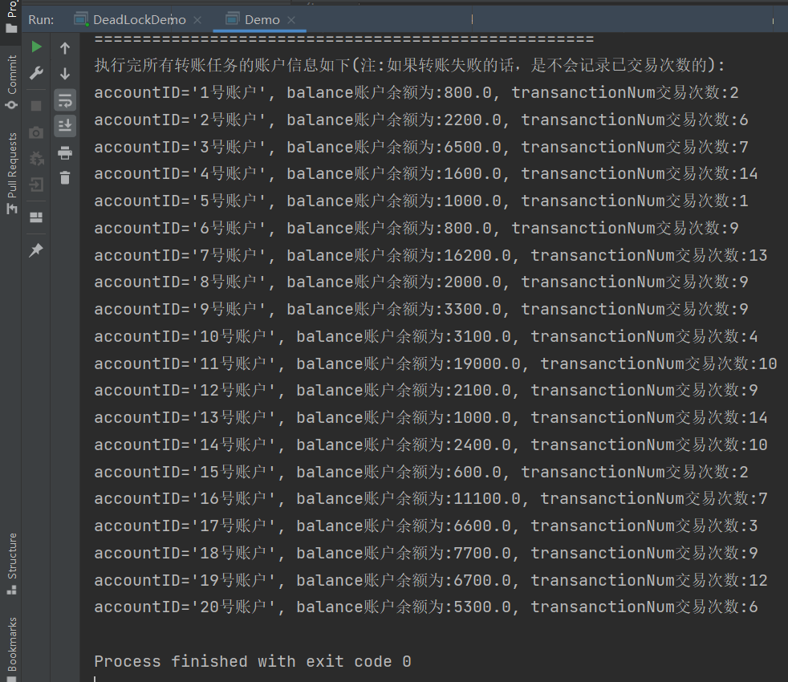

#### CourseWork3实现细节
2.* （20）创建一个如下图所示GUI包含4个相同的部分，每个部分有一个独立的worker thread实现计数功能，从TextField输入从1~100,000,000中任意一个数，每间隔一段时间，Label表示当前worker thread所统计的数值。Start Button首先是否有正在计数的work thread运行，如果有正在运行的work thread, 中断该thread的运行，从零开始计数。Stop Button将会中断worker threads的运行。
运行结果截图:


核心方法代码:
JCount 继承JPanel 类，每一个JCount就是一个计数面板，里面包含一个线程对象，用于开始计数。在Jpanel里添加上三个JCount对象，再将Jpanel对象加入Jframe运行。
```java
# 用于start按钮的事件
public void startBtnHandler() {
        if (oneCountThread.isAlive() || oneCountThread.isInterrupted()) {//如果线程还存在，就归零
            oneCountThread.fromZeroCount();
        } else if (!"".equals(numTxt.getText().trim()) && numTxt.getText() != null) {//第一次开始计数
            if (Integer.parseInt(numTxt.getText()) > 0) {
                oneCountThread.start();//启动计数线程
            }
        }
        oneCountRunning = 1;
    }

    //每数到10,000，Worker Thread会睡眠100 milliseconds
    public void countSleep() {
        if (oneCountThread.isUpdateLabel()) {
            try {
                oneCountThread.sleep(100);
                numLabel.setText(String.valueOf(oneCountThread.getCurNum()));//更新Label数字
                oneCountThread.setUpdateLabel(false);
            } catch (InterruptedException e) {
                e.printStackTrace();
            }
        }
    }

```
WorkThread类:继承Thread类，用于实现计数，考虑到数字变化过快，不易观察，使用一个数字做实际计数(快计数)，另一个数字做慢计数。
核心代码:
```java
 @Override
    public void run() {
        while (slowNum >= 0) {
            fastNum++;
            if (fastNum % 10000 == 0)//考虑到程序直接计数过快
                slowNum = slowNum + 10;
            if (slowNum % 10000 == 0 && slowNum != 0) {
                tempNum = slowNum;
                setUpdateLabel(true);
            }
            System.out.print("");
            if (this.currentThread().isInterrupted())
                break;
        }

    }
```

3. 程序1：模拟实现两个账户转账时出现死锁。
**（10）程序2：再次模拟解决死锁后，两个账户能正确转账，采用synchronized/wait(notify)或者lock/await(signal)两种方式之一完成。
程序1模拟死锁代码:
```java
public static void main(String[] args) {
        Object director = new Object();
        Object actor = new Object();

        //0x7954
        new Thread(() -> {
            while (true) {
                synchronized (director) {
                    System.out.println("导演账户取出3000元");
                    try {
                        Thread.sleep(300);//模拟线程中断    需要等待抢到CPU执行权
                    } catch (InterruptedException e) {
                        e.printStackTrace();
                    }
                    //线程一 从导演向演员转账
                    synchronized (actor) {
                        System.out.println("导演成功向演员转账3000元");
                    }
                }
            }
        }).start();

        //0X3704
        new Thread(() -> {
            while (true) {
                synchronized (actor) {
                    System.out.println("演员账户取出40000元");
                    try {
                        Thread.sleep(300);
                    } catch (InterruptedException e) {
                        e.printStackTrace();
                    }
                    //线程二 从演员向导演转账
                    synchronized (director) {
                        System.out.println("演员向导演转账40000元");
                    }
                }
            }
        }).start();

    }
```
- 运行结果:死锁情况，互相持有对方的锁，谁也不能继续执行任务下去


程序2:通过对线程需要使用到的资源进行排序，从大到小的方式对资源加锁，即使用hash算法对资源排序，然后加锁。
核心代码:
```java
# run()方法里调用该方法进行转账
public void transferMoney(Account accountFrom, Account accountTo, int accountAmount) {
        //大Boss留下了一个表格， 里边是个算法，用来计算资源的大小，计算出来以后，永远按照从大到小的方式来获得锁
        //这里使用hash值作为算法计算资源大小
        System.out.println("当前准备转账线程为:" + Thread.currentThread().getName());
        int accountFromHash = System.identityHashCode(accountFrom);
        int accountToHash = System.identityHashCode(accountTo);
        if (accountFromHash > accountToHash) {//大的hash值先获得它的锁
            synchronized (accountFrom) {
                try {
                    Thread.sleep(100);
                } catch (InterruptedException e) {
                    e.printStackTrace();
                }
                synchronized (accountTo) {
                    transferMoneyWorker(accountFrom, accountTo, accountAmount);
                }
            }
        } else if (accountFromHash < accountToHash) {
            synchronized (accountTo) {
                try {
                    Thread.sleep(100);
                } catch (InterruptedException e) {
                    e.printStackTrace();
                }
                synchronized (accountFrom) {
                    transferMoneyWorker(accountFrom, accountTo, accountAmount);
                }
            }
        } else {//hash冲突
            synchronized (hashConflictShareLock) {
                synchronized (accountFrom) {
                    try {
                        Thread.sleep(100);
                    } catch (InterruptedException e) {
                        e.printStackTrace();
                    }
                    synchronized (accountTo) {
                        transferMoneyWorker(accountFrom, accountTo, accountAmount);
                    }
                }
            }
        }
}
# 对资源加锁后，对二个账户进行操作
private void transferMoneyWorker(Account accountFrom, Account accountTo, int amount) {
        System.out.println("当前转账worker线程为:" + Thread.currentThread().getName());
        if (accountFrom.getBalance() < amount) {
            System.out.println(accountFrom.name + "账户余额不足以转账，请重新选择业务");
            return;
        } else {//正常转账
            accountFrom.setBalance(accountFrom.getBalance() - amount);
            accountTo.setBalance(accountTo.getBalance() + amount);
            System.out.println("执行线程为" + Thread.currentThread().getName() + "\t\t账户:" + accountFrom.name + "成功向账户:" + accountTo.name + "转账" + amount + "元");
        }
    }
```


4. 第4题升级版本：模拟实现多线程处理银行的实时转账交易，假设银行有20个账户，每个账户均有本金1000元，程序将实现各个账号之间不同金额的转账交易。
类说明:
1. RandomTransfer类:随机生成[100,200]条转账记录写入文件，以供测试。
2. BlockingQueueCooker类:生产者类，继承Thread ,读取文件中的转账记录，加入到阻塞队列中
```java
# 核心的run()方法
 @Override
    public void run() {
        int cntInfo = 0;
        //主线程从一个文件中读取交易信息
        BufferedReader br = null;
        try {
            br = new BufferedReader(new FileReader("Transfer_record.txt"));
        } catch (FileNotFoundException e) {
            e.printStackTrace();
        }
        String line = null;
        try {
            line = br.readLine();
        } catch (IOException e) {
            e.printStackTrace();
        }
        while (line != null) {
//            System.out.println("读取到的数据如下:" + line);
            try {
                transInfo.put(line);
                cntInfo++;
                // System.out.println("读入一条转账信息");
            } catch (InterruptedException e) {
                e.printStackTrace();
            }
            try {
                line = br.readLine();
            } catch (IOException e) {
                e.printStackTrace();
            }
        }
        try {
            br.close();
        } catch (IOException e) {
            e.printStackTrace();
        }
        System.out.println("成功读入" + (cntInfo - 1) + "条交易信息");// -1 0 0不算有效交易信息
        System.out.println("生产者线程运行完毕!!!");

    }
```

3. Bank类：消费者类，继承Thread类，处理阻塞队列里面的转账记录，线程池submit()子线程处理。
```java
@Override
    public void run() {
        //使用线程池创建多个子线程执行转账任务
        threadPoolExecutor = new ThreadPoolExecutor(10, 50, 20,
                TimeUnit.SECONDS, new ArrayBlockingQueue<>(100),
                Executors.defaultThreadFactory(), new ThreadPoolExecutor.DiscardOldestPolicy());
        String[] oneInfo;
        while (true) {
            try {
                oneInfo = transferInfo.take().split(" ");//取出交易信息
                //交易过程
                //得到信息   数组下标从0开始
                int from = Integer.parseInt(oneInfo[0]);
                int to = Integer.parseInt(oneInfo[1]);
                int amount = Integer.parseInt(oneInfo[2]);
                //判断读取完成
                if (from == -1 && to == 0 && amount == 0) {
                    System.out.println("当前消费者线程运行结束");
                    threadPoolExecutor.shutdown();//关闭线程池
//                    return;
                    break;
                }
                //线程池处理  创建多个子线程
                threadPoolExecutor.submit(new TransferRunable(allAccount.get(from - 1), allAccount.get(to - 1), amount));

            } catch (InterruptedException e) {
                e.printStackTrace();
            }
        }
        //判断线程池所有线程是否执行完-----> 执行完才能打印所有账户信息
        while (!threadPoolExecutor.isTerminated()) {

        }
        System.out.println("==================================================");
        System.out.println("线程池关闭，成功执行完所有转账任务！！！");
        System.out.println("====================================================");
        System.out.println("执行完所有转账任务的账户信息如下(注:如果转账失败的话，是不会记录已交易次数的):");
        for (Account acc : allAccount) {
            System.out.println(acc);
        }

    }
```
4. TransferRunable类：实现Runnable接口，处理一条转账记录。使用hash算法作为规则，优化获取hash值大的资源的锁，以此解决多线程中多个资源锁获得先后次序不同而导致的死锁问题。
```java
@Override
    public void run() {
        // System.out.println("当前准备转账线程为:" + Thread.currentThread().getName());
        int accountFromHash = System.identityHashCode(fromAccout);
        int accountToHash = System.identityHashCode(toAccount);
        if (accountFromHash > accountToHash) {//大的hash值先获得它的锁
            synchronized (fromAccout) {
                try {
                    Thread.sleep(100);
                } catch (InterruptedException e) {
                    e.printStackTrace();
                }
                synchronized (toAccount) {
                    transferMoneyWorker(fromAccout, toAccount, amount);
                }
            }
        } else if (accountFromHash < accountToHash) {
            synchronized (toAccount) {
                try {
                    Thread.sleep(100);
                } catch (InterruptedException e) {
                    e.printStackTrace();
                }
                synchronized (fromAccout) {
                    transferMoneyWorker(fromAccout, toAccount, amount);
                }
            }
        } else {//hash冲突
            synchronized (hashConflictShareLock) {
                synchronized (fromAccout) {
                    try {
                        Thread.sleep(100);
                    } catch (InterruptedException e) {
                        e.printStackTrace();
                    }
                    synchronized (toAccount) {
                        transferMoneyWorker(fromAccout, toAccount, amount);
                    }
                }
            }
        }
    }

    private void transferMoneyWorker(Account accountFrom, Account accountTo, int amount) {
        System.out.println("当前转账worker线程为:" + Thread.currentThread().getName());
        if (accountFrom.getBalance() < amount) {
            System.out.println(accountFrom.getAccountID() + "账户余额不足以转账，请重新选择业务");
            return;
        } else {//正常转账
            accountFrom.setBalance(accountFrom.getBalance() - amount);
            accountTo.setBalance(accountTo.getBalance() + amount);
            accountTo.setTransanctionNum(accountFrom.getTransanctionNum() + 1);
            accountFrom.setTransanctionNum(accountFrom.getTransanctionNum() + 1);

            System.out.println("执行线程为" + Thread.currentThread().getName() + "\t\t账户:" + accountFrom.getAccountID() + "成功向账户:" + accountTo.getAccountID() + "转账" + amount + "元");
        }
    }
```
5. Account类：保存账户数据的类
代码截图:


=============================================================

- 运行结果截图:

